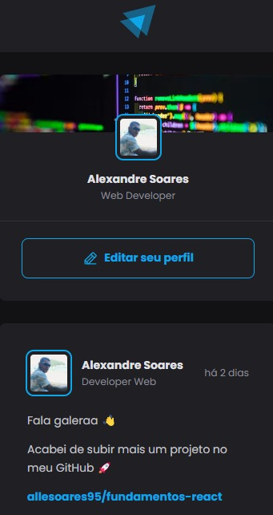

# Projeto fundamentos React 

#

Precisar ter Node instalado na sua maquina antes de iniciar o projeto ;

* instalação do vite;

Crie uma pasta e rode 
 `npm create vite@latest` para windows  

* Crie o nome do projeto 

* Escolha o framework: `react`

* Escolha a variant: `react-ts`

# 
Instale as dependencias dentro do projeto :

`npm install ` ou `npm i`

#

Mais informações do vite : https://vitejs.dev/guide/ 

# 
* Icons

https://phosphoricons.com/   

https://github.com/phosphor-icons/homepage  